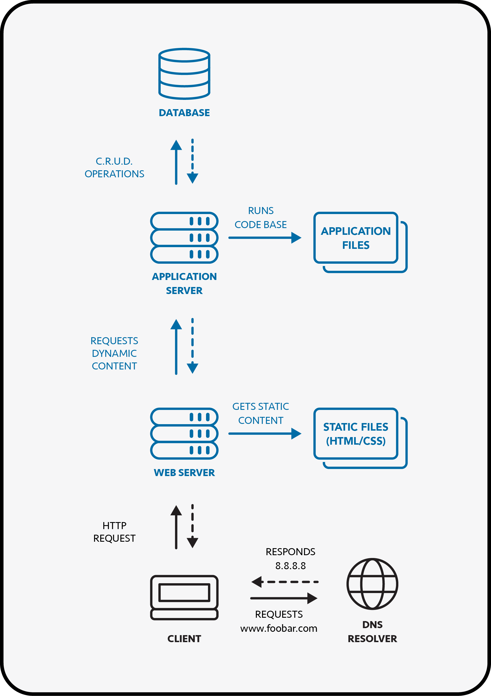

## Simple Web Stack

This basic infrastructure, also called **LAMP Stack**, consists in:

- A domain name (www.foobar.com resolving to 8.8.8.8)
- A web server (Nginx) that can serve static files
- An application server that can run application files
- A database (MySQL)

### 1. How does it work?

When a client tries to connect to www.foobar.com, the browser will first check if the website has already been accessed before to get its IP address. If it hasn't, it will connect to a DNS Resolver, that will respond with the IP address of the web server (`8.8.8.8`). The browser will then establish a connexion with it and send it an HTTP request on the correct port (`80`). The web server will respond with static files (HTML/CSS) to be displayed in the browser, and if dynamic content is needed, it will ask the application server. This server will run the code base and interact with the database with CRUD operations to respond with the correct data.

    

### 2. Infrastructure Specifics

#### What is a Server?

A server is a physical or virtual computer running an operating system with dedicated software, to provide sepcific services to other computers.

#### Role of the Domain Name:

A domain name (in this case `foobar.com`) is a way to easily remember the address of a website, so we don't have to remember its IP address (in this case `8.8.8.8`). A **DNS Resolver** is mandatory to get the correct IP address when trying to access a website with its domain name.

#### What type of DNS record `www` is in `www.foobar.com`?

The `www` DNS record is of type **A**, since it points directly to the server IP (`8.8.8.8`).

#### Role of the Web Server:

The web server (in this case `Nginx`) is responsible for reveiving HTTP requests and responding to those, by serving static content (HTML/CSS files) to the client's browser, and by forwarding requests for dynamic content to the application server.

#### Role of the Application Server:

The application server is responsible for running scripts from the code base, to generate dynamic content by interacting with the database, and forwarding it to the web server so that it can send it back to the client.

#### Role of the Database:

The database is responsible for the persistence of the website's data on the server. The application server will interact with the database through basic operations like creating, reading, updating and deleting data, according to the logic implemented in the application files.

#### Communication between the Server and the Client:

The server uses TCP/IP (Transmission Control Protocol/Internet Protocol) to communicate with the client, with HTTP(S) (Hypertext Transfer Protocol) formatted requests and responses.

### 3. Infrastructure Issues

#### Single Point of Failure:

A single point of failure (SPOF) is a part of a system that would stop the entire system from working if it were to fail. In the case of a LAMP Stack as this one, it can represent a major issue since everything is hosted on the same server. If it goes down for any reason, the whole website becomes inaccessible.

#### Downtime & Maintenance:

Deploying new code on the server, uodating the system or fixing an issue could require restarting the server, which can be an issue in a LAMP Stack since it will result in a downtime, making the website inaccessible to users.

#### Excess of Incoming Traffic:

In the case of a LAMP Stack, the excess of incoming traffic represents an issue, since the server can be overloaded as it cannot handle too many requests at the same time. This scalability problem will result in slow performances for clients trying to access the website.
