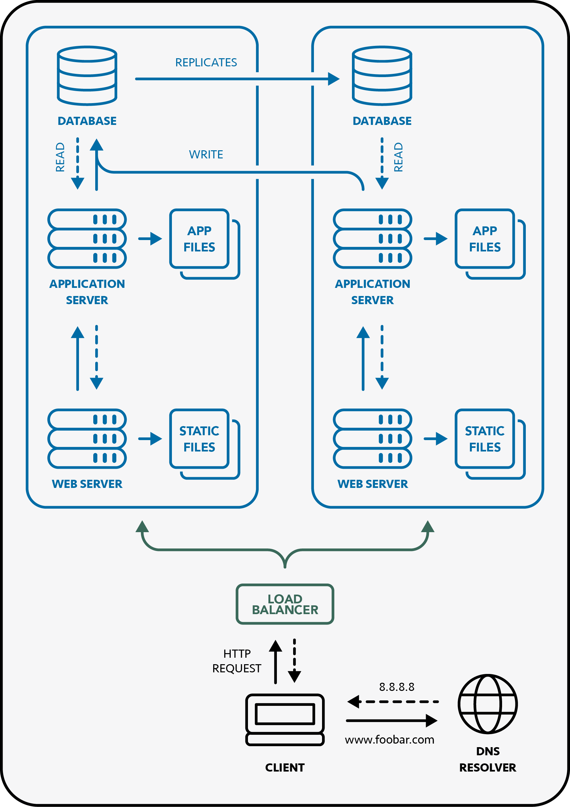

## Distributed Web Infrastructure

This infrastructure, with several instances of the same server, consists in:

- A domain name (www.foobar.com resolving to 8.8.8.8)
- A load balancer (HAproxy)
- Two servers that each contains:
  - A web server (Nginx) that can serve static files
  - An application server that can run application files
  - A database (MySQL)

### 1. How does it work?

When a client tries to connect to `www.foobar.com`, the browser will first get the IP address using the **DNS Resolver**. The browser will then establish a connexion with the **Load Balancer** and send it an HTTP request on the correct port (`80`). The **Load Balancer** will then choose on which server it will forward the request, according to the algorithm it was designed to use. The request will finally be treated by the **Web Server** and the **Application Server** as in a simple web stack, before sending back the response.

 

    

 

### 2. Infrastructure Specifics

#### Why using a Load Balancer and Several Servers?

Using a single server might become an issue if the number of users increases, causing potential performance issues (or even crashing) that might slow down user experience. Using two or more servers help avoid this issue, with a **Load Balancer** designed with an distribution algorithm to forward all users to different servers.

#### Load Balancer Distribution Algorithm:

A common and simple way for the load balancer to distribute requests would be to use a **round robin** algorithm, which forwards requests sequentially to each server in turn.

#### Active-Active / Active-Passive Load Balancer Setup:

In the case several load balancers are implemented, they can be configured either in an **Active-Active** or in an **Active-Passive** way:

- **Active-Active**: With this configuration, multiple load balancer instances are running simultaneously and actively handling all the web traffic. If one of the load balancers fails, the others keep on handling requests.
- **Active-Passive**: With this configuration, only one load balancer is running and actively handling all the web traffic, while the others are standing by. If the active one fails, one of the others is automatically activated to take over.

#### Database Primary-Replica (Master/Slave) Cluster:

On a distributed web infrastructure where multiple copies of the database are used by different server, modifications made on the primary database need to be replicated to each copy of the database, so that all data stays consistent across the system. With the **Primary-Replica** cluster model, a main instance of the database, called the **primary** (or the **master**), is the one where all writing operations are applied. These operations are then recorded in a log file, called the **binlog**, which is used to replicate the changes on the secondary instances of the database, called the **replicas** (or the **slaves**).

### 3. Infrastructure Issues

#### Single Point of Failure:

Even with a distributed web infrastructure like this one, single points of failure can be identified. In the case the **Load Balancer** fails, the whole website becomes inaccessible to users. Also, if the server with the **Primary Database** instance fails, all writing operations will be impossible to achieve.

#### Security Issues:

With this setup, although performance and scalability improvements are made compared to a simple web stack, some security flaws can be identified:

- **Absence of Firewall**: The lack of any **firewall** means that there's no control of any sort on the web traffic that goes through the servers, making it vulnerable to various attacks.
- **Use of HTTP**: The use of **HTTP** instead of **HTTPS** means that requests and responses are not encrypted, and that sensitive data (like passwords or payment information) are transmitted in plain text, and can therefore be read or used if intercepted by malicious people.

#### Absence of Monitoring:

No monitoring on the server means **no visibility** over performances of the various components running on the infrastructure, and therefore no alert related to low disk space, time efficiency or application erors.
