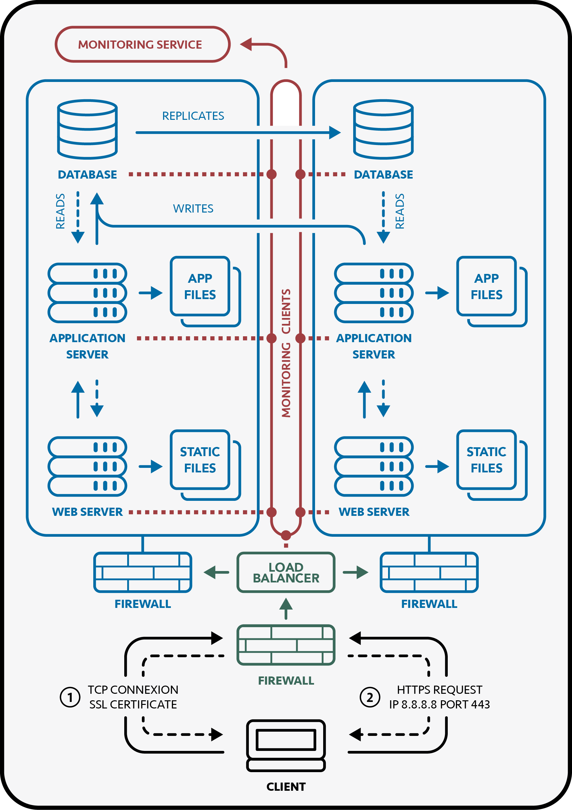

## Secured & Monitored Web Infrastructure

This secured and monitored infrastructure, with several instances of the same server, consists in:

- A domain name (www.foobar.com resolving to 8.8.8.8)
- A firewall
- A load balancer (HAproxy)
- An SSL/TLS certificate
- Monitoring clients
- Two servers that each contains:
  - A web server (Nginx) that can serve static files
  - An application server that can run application files
  - A database (MySQL)

### 1. How does it work?

When a client tries to connect to `www.foobar.com`, the browser will first get the IP address using the **DNS Resolver**. The browser will then establish a connexion with the **Load Balancer** to get an SSL certificate for requests encryption. Then, it will send it an HTTPS request on the correct port (`443`). The **Load Balancer** will then choose on which server it will forward the request, according to the algorithm it was designed to use. The request will finally be decrypted and treated by the **Web Server** and the **Application Server** as in a simple web stack, before sending back the response.

 

    

 

### 2. Infrastructure Specifics

#### Role of the Firewalls:

Firewalls are network devices designed to improve security on a server by **controlling** and **restricting** incoming traffic through a set of predefined rules. They can prevent a network from:

- **Unauthorized Access**: Filtering external IP addresses to restrict users from directly accessing internal services.
- **Port Scanning**: Blocking probes that attempt to discover open or weak entry points.
- **Unwanted Protocols/Ports**: Restricting traffic to allow specific ports only, such as port 443 (`HTTPS`) and port 22 (`SSH`).
- **Common Attacks**: Filtering malicious payloads to avoid **SQL injections** and detecting / dropping abnormal surges of traffic to avoid **DoS attacks**.

#### Benefits of HTTPS:

HTTPS is a secure transfer protocol that provides several key security improvements over standard HTTP. It enforces **traffic encryption** using `SSL/TLS` certificates, ensuring that data exchanged cannot be read or used if intercepted by malicious people. It also provides website **authentication**, allowing users to verify that a website is legitimate and helping to prevent phishing.

#### Role of the Monitoring:

Server monitoring is the practice of continuously **tracking** the performance, availability, and security of servers. It helps **detect issues** such as downtime, unusual traffic, or resource exhaustion early, so they can be resolved before impacting users. Monitoring also provides valuable insights into system health and usage, allowing administrators to optimize performance and plan for future needs.

### 3. Infrastructure Issues

#### SSL Termination:

Terminating SSL by decrypting the traffic at the load balancer level can constitute an issue:

- **Traffic Exposition**: All the traffic on the servers is unencrypted, letting sensitive data like passwords or tokens visible to internal actors, like potential malicious employees or misconfigured monitoring tools.
- **Compliance Concerns**: Regulations for credit card data and health data often require end-to-end encryption. SSL offloading at the load balancer without re-encryption might not meet those requirements.

#### Database Server:

Having a single database server able to write can constitute an issue:

- **Single Point of Failure**: If the server goes down and no failover procedure is defined, there is no way to handle write operations.
- **Scalability**: If the web application generates a high volume of inserts or updates, the server can become overwhelmed.
- **Latency**: As replicas/slaves may experience a slight delay compared to the primary/master, some read queries may not immediately reflect the latest changes.
